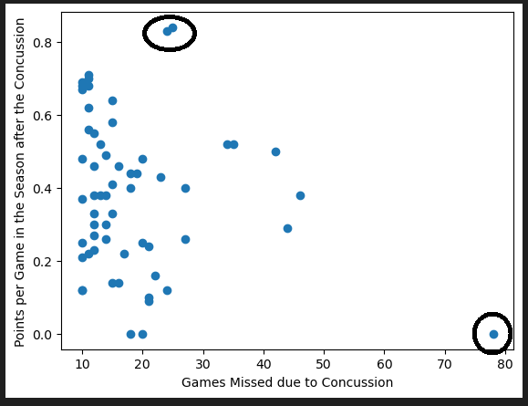
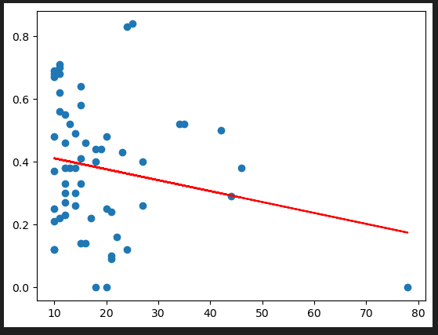
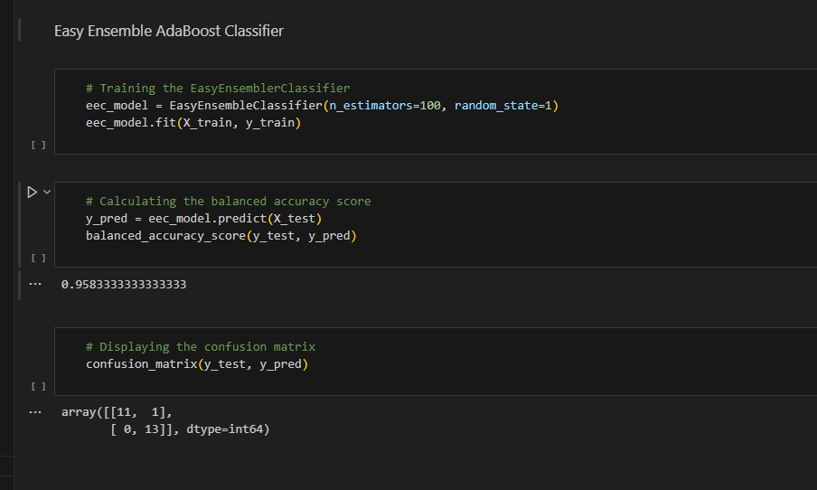
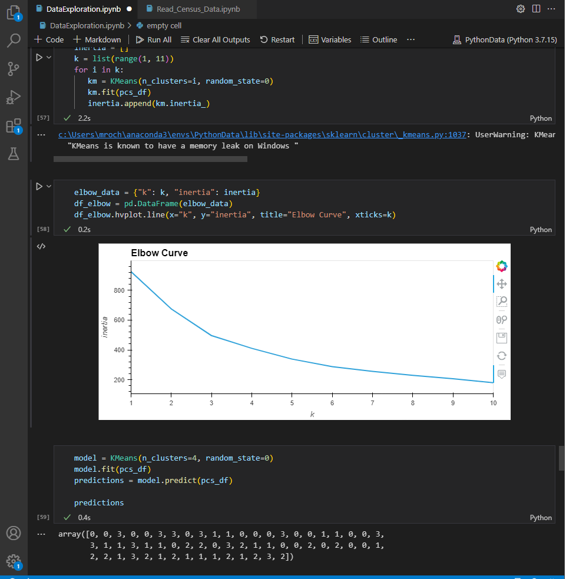
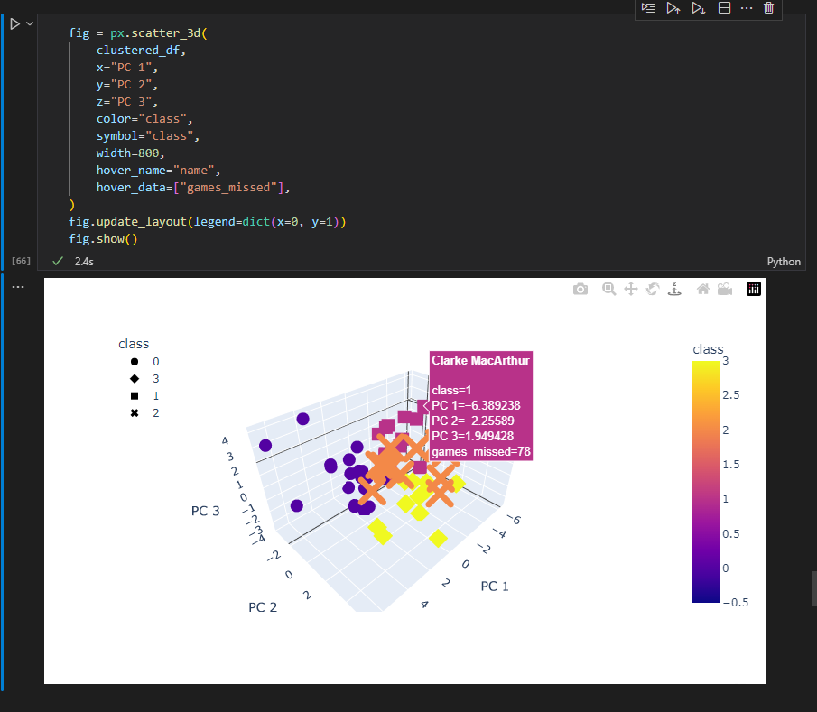

# NHL Concussion Analysis
A data analysis used to predict the impact of concussions on an NHL player's career.
___

### Overview

Our group decided to focus our attention onto an analysis involving something in the sports world. In recent years, the NHL has been riticuled for its handling of player concussions and the potential long-term effects on their health and careers. Our hope is for this analysis to provide a data-driven perspective on the issue.

The data we used in this analysis is sourced from various publicly available datasets on NHL players and their careers. The analysis focuses on several key metrics, including the number of concussions sustained by players, the amount of games missed because of those concussions, and the effect they have on a players performance and longevity in the league.

The project will be implemented using Python and JavaScript. The data will be cleaned and pre-processed to ensure its quality before performing exploratory data analysis to identify trends and insights. Additionally, statistical models will be used to quantify the relationship between concussions and career outcomes. We will have an interactive aspect to the analysis for more detailed answers, this will be done on a created website.

The results of this analysis may provide awareness for the NHL and its stakeholders to better understand the long-term impact of concussions on player health and career longevity. Ultimately, this information may help inform future policies and practices to improve player safety and well-being.
___

### Getting Started

##### Datasets
* NHL Concussions Database_data.csv from: [This link](https://www.kaggle.com/datasets/josephmclauchlan/nhl-concussion-data-2012-2023?resource=download)
    - Removed unwanted columns
    - Changed format of Names, Teams and Season to match other dataset
    - Removed goalies
    - 5 columns by 357 rows after cleaning

* Skaters.csv for 2012-2013 to 2022-2023 from: [This link](https://moneypuck.com/data.htm)
    - Joined datasets from 2012-2022
    - Removed unwanted columns
    - Dropped every situation except for 'all'
    - 13 columns by 9938 rows after cleaning

* Players_of_interest.csv
    - A dataset built from joining together the concussion dataset and the player sataset
    - Created to provide a dataset of all players that have had concussions during the timeframe of our dataset
    - 15 columns by 580 rows
    - added a new column 'points_per_game' to have a value that represents a player's performance

* ML_player_dataset.csv
    - A dataset built to have a more detailed list of data for a predective machine learning model.
    - Added columns of PPGP and PPGN, to have values for players points per game the season before their concussion and points per game the season after their concussion.
    - 17 columns by 15 rows

##### Dependencies 
* Python 3.9.15
* Pandas 1.5.22
* 
* 
___

### Summary

##### ERD

Joined all of the skater data from each season onto one dataset, using 'name' as the foreign key. Then we joined the final skater dataset with the concussion dataset on our primary key called pkey. This column was created by joining the player name and season.
##### SQL

* SQL Join Code

* SQL Output 

The final visual of our joined dataset.

##### Data Exploration
For data exploration, our goal was to find some details in our data that would help us build our machine learning model that could answer our original question of, does a concussion have any long-term effects on a player's career? To begin exploring this question, we first need to gather and clean the relevant data. This includes data on players who have suffered concussions, as well as data on their performance before and after the concussion. Once we have this data, we can start exploring it to identify any patterns or trends that may indicate a long-term impact on a player's career. This could involve examining the number of games missed due to concussion, changes in performance metrics such as points per game, or other relevant factors. By exploring the data, we hope to gain a deeper understanding of the effects of concussions on NHL players.

##### Tableau
We used Tableau as a form of data exploration, and to create some visuals of findings we made. The Tableau dashboard is available at this
[link](https://public.tableau.com/app/profile/tyler.sweeting4938/viz/NHL_Concussion_Analysis/NHLStoryAnalysis?publish=yes).

This first image is a collection of multiple bar charts that compares points per game by each season. It also identifies each season a player had a concussion or not, and the amount of games they played that season. As the visual shows, there is no consistency in a concussion leading to a reduced amount of points per game in seasons following a concussion.

The next visual is a collection of bar charts that show a players fenwick percentage seasn by season and identifying the year they were concussed. Fenwick percentage is a stat that shows the percentage of scoring chances a team gets while a specific player is on the ice. The higher the number the better. As you can see from the visual, the year a player is concussed does not seem to have a lasting effect on a player's fenwick.

##### Website
Our website is the main dashboard for our analysis.

We have a home page, and two secondary pages. The first page being a filter page that shows the history of concussions on NHL player's since 2012. There are multiple ways that you can filter. 

You can search a player's name:

You can filter by season:

You can filter by player:

 The second page is a connection to our machine learning model that can be used to predict the effects a concussion will have on a player. 

### Machine Learning
We chose our machine learning models with the intention of allowing for a user to estimate with some degree of certainty the number of Points/Game a player would likely score in a seaason if they suffered a major concussion (defined by missing more than 10 games) the year prior. With this in mind we first chose a basic linear regression model to see how well our data points of players with major concussions fit a predictive model.

## Linear Regression Model
With the data fit into a scatter plot we can immediately see that the less severe of the major concussion (<20 missed) allowed the players to return the next season with a high rate of points scored per game. However, when we look at the major concussions it becomes immediately obvious that the injury has impaired their abilities. There are of course outliers on both sides of the set with two players having impressive years after a season with a significant concussion, as well as other players with less severe concussions having what would be considered off years.

When we fit the line of best fit to this data it becomes clear immediately that the significant grouping of concussions under 20 games will make this model not accurate for prediction.

## Easy Ensemble AdaBoost Classifier
Using an Easy Ensemble AdaBoost Classifier allowed us the ability to classify the data that we were inputing into the model with a high degree of precision and accuracy.

As you can see by the confusion matrix the precision of the model only returned one instance of false prediction, and the balanced accuracy score showed results of 95.83%. These results showed the most promise for further use as machine learning models.

## Other Supervised Machine Learning Models
The Balanced Random Forest Classifier model was also attempted, however it resulted in similar, yet worse results to the AdaBoost Classifier.

## Unsupervised Machine Learning
We also made an attempt at fitting an unsupervised model in the for of the PCA model. And while the results were interesting and highly interactive, the data clusters were ultimately decided to be of less use than the supervised machine learning models.

As you can see with the elbow curve it is difficult to tell exactly where the curve becomes primarily horizontal. A K value of 4, and 6 were attempted but unfortunately deriving data from those clustered proved fruitless.

The large portion of the data is centered around 0 on all three axes. However, you can see even in this data that the two outliers observed with major concussion and high Points/Game in the next season are clearly visible in the top left corner.
___
### Results 

Our analysis was focused on understanding the impact of concussions on player performance in the NHL. Initially, we had assumed that players who suffered from a serious concussion would experience a decline in their performance when returning to play. However, after conducting a detailed data exploration, we found no consistent evidence to support this assumption. We analyzed players' points per game and their fenwick percentage during the season after they missed over 10 games due to a concussion, and found no significant drop-off in performance. While some players did choose to retire due to the effects of their concussions, those who returned to play did not appear to be impacted in any significant way.

One possible explanation for these findings is that advances in medical technology and concussion management have helped players recover more quickly and effectively from these injuries. Over the years there has been increased awareness of the long-term impact of concussions, leading to improvements in protocols for detecting and responding to them. As a result, players are now more likely to receive appropriate medical attention and treatment in the immediate aftermath of a concussion, which may help to minimize any long-term effects.

If this analysis was done a decade ago, I am sure our results would have shown more of a drop-off in a player's production when returning from a concussion. The attention that concussions have been receiving in the NHL seems to be having a positive impact on a player's recovery and hopefully continue to go in the same direction as time goes on. Hopefully one day it gets to a point where a concussion will never force a player to retire, and there will be no fear of potential health concerns later on in life.

If we were to do further analysis on this project, there are a few things that could be done next. We could try to find some datasets from further back in time to compare the impact concussions had back then to the impact they have now. For our machine learning model we needed to create two additional columns of data, being points-per-game in the previous season and in the following season of a concussion. When adding this to the points per game of the season of the concussion that makes for 3 columns. It could be reduced to 2 columns by changing it to difference between previous season and current season, as well as difference between following season and current season. 

##### Slideshow
[Link to slideshow](https://docs.google.com/presentation/d/1890SfoJNAox-6K8u-hvgCQe1gRSIRcmOk8xXY5-6Qu8/edit#slide=id.p).

___
### Authors

##### Ahmed Hakeem
- Data Engineer: Front-end Developer; Creation and development of website dashboard.
##### Michael Rochon
- Data Scientist: Managing the database, joining datasets together and Machine Learning.
##### Tyler Sweeting
- Data Analyst/Project Coordinator: Data exploration, organizng and coordinating tasks.
